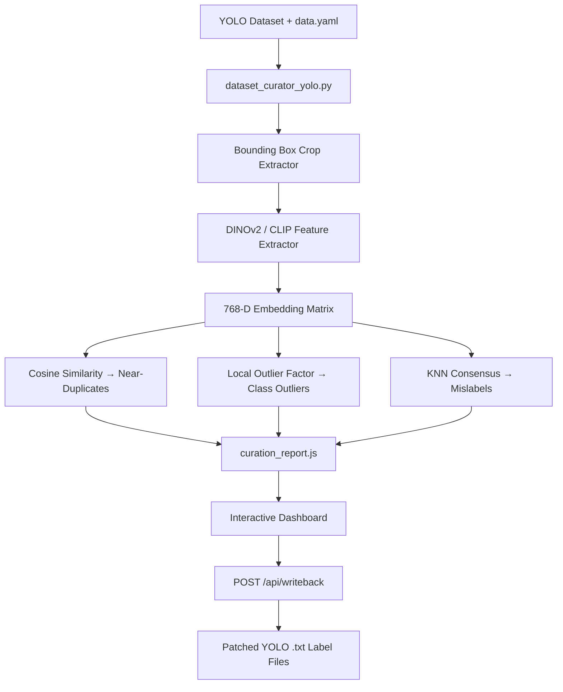

# CleanCrop — YOLO Dataset Quality & Curation Dashboard

> Visual YOLO dataset curation powered by DINOv2/CLIP embeddings — detect near-duplicates, outliers & mislabels before training, then write corrections directly back to your label files.


---

## What is CleanCrop?

Training on dirty data silently degrades model accuracy. CleanCrop is an **end-to-end pipeline** that:
1. Extracts individual object crops from YOLO bounding box annotations
2. Embeds them using **DINOv2** or **CLIP** vision models
3. Detects **near-duplicates**, **class outliers**, and **suspected mislabels** using unsupervised algorithms
4. Presents everything in an **interactive 2D/3D web dashboard** for human-in-the-loop review
5. Writes approved corrections **directly back to the source `.txt` label files**

---

## Pipeline Architecture



---

## Key Features

| Feature | Detail |
|---|---|
| **Deep Embeddings** | DINOv2 (`facebook/dinov2-base`) or CLIP (`openai/clip-vit-base-patch32`) |
| **Near-Duplicate Detection** | All-pairs cosine similarity with configurable threshold |
| **Outlier Detection** | Class-wise Local Outlier Factor (LOF) scoring |
| **Mislabel Detection** | KNN majority-class consensus voting |
| **2D/3D PCA Explorer** | Browser-side SVD projection — pan, zoom, rotate |
| **3D Depth Rendering** | Painter's Algorithm + depth-cueing (opacity & point size) |
| **Real-time Threshold Tuning** | Sliders recompute all metrics live in the browser |
| **Label Writeback API** | `POST /api/writeback` patches source label files directly |
| **Zero Dependencies (frontend)** | Pure HTML + Vanilla JS + CSS — no npm, no build step |

---

## Repository Structure

```
yolo-dataset-curator/
├── dataset_curator_yolo.py   # Full pipeline: crop → embed → detect → serve API
├── index.html                # Dashboard UI layout
├── styles.css                # Dark-mode glassmorphic styling
├── app.js                    # PCA engine, 3D renderer, curation state, writeback fetch
├── requirements.txt          # Python dependencies
└── road_traffic_curated/     # Example output (generated, not committed)
    ├── demo_dataset/
    │   ├── crops/            # Extracted crop images
    │   └── curation_report.js
    ├── index.html
    ├── app.js
    └── styles.css
```

---

## Installation

```bash
git clone https://github.com/Arihant3704/yolo-dataset-curator-.git
cd yolo-dataset-curator-
pip install -r requirements.txt
```

**Requirements:** Python 3.8+, PyTorch, a CUDA GPU is recommended for large datasets.

---

## Usage

### Full pipeline — crop, embed, detect, then launch dashboard

```bash
python dataset_curator_yolo.py \
    --dataset-dir /path/to/your/yolo_dataset \
    --output-dir curation_output \
    --model dinov2 \
    --dup-threshold 0.95 \
    --lof-threshold 1.3 \
    --serve \
    --port 8000
```

Then open: **http://localhost:8000/index.html**

### Dashboard only — view a pre-computed report without re-running inference

```bash
python dataset_curator_yolo.py \
    --dataset-dir /path/to/your/yolo_dataset \
    --output-dir curation_output \
    --serve-only \
    --port 8000
```

### CLI Argument Reference

| Argument | Default | Description |
|---|---|---|
| `--dataset-dir` | `auto/road_traffic` | Path to YOLO dataset folder containing `data.yaml` |
| `--output-dir` | `road_traffic_curated` | Output directory for crops, JSON report, and dashboard |
| `--model` | `dinov2` | Feature extractor: `dinov2` or `clip` |
| `--dup-threshold` | `0.95` | Cosine similarity cutoff for near-duplicate flagging |
| `--lof-threshold` | `1.3` | LOF score threshold for outlier flagging |
| `--knn-k` | `5` | K for KNN mislabel consensus |
| `--batch-size` | `32` | Embedding extraction batch size |
| `--serve` | `false` | Launch dashboard after full pipeline run |
| `--serve-only` | `false` | Launch dashboard for existing output (no inference) |
| `--port` | `8000` | HTTP server port |

---

## Dashboard Guide

### Tabs
- **Overview** — Dataset health score, summary stats, interactive PCA plot
- **Near-Duplicates** — Side-by-side crop pairs ranked by similarity score
- **Outliers** — LOF-flagged crops displayed with their density scores
- **Mislabels** — KNN-flagged crops with suggested correct class
- **Data Explorer** — Full grid of all crops with search, filter, and sort

### PCA Plot Controls
- **2D mode** — Scroll to zoom, drag to pan, click to inspect
- **3D mode** — Toggle the "3D Mode" button, then drag to rotate
- **Reset View** — Double-click the canvas

### Curation Actions
1. Select a crop in any tab
2. Click **Exclude Crop** (removes from dataset) or **Relabel** (changes class)
3. The floating bar shows pending action count
4. Click **Export Curation File (.json)** for a human-readable audit log
5. Click **Commit to Dataset (Writeback)** to apply changes to source `.txt` label files

> ⚠️ Writeback directly overwrites your source YOLO label files. Back up your dataset before committing.

---

## YOLO Dataset Format

CleanCrop expects the standard YOLO directory layout:

```
dataset/
├── data.yaml
├── train/
│   ├── images/   *.jpg / *.png
│   └── labels/   *.txt
├── valid/
│   ├── images/
│   └── labels/
└── test/
    ├── images/
    └── labels/
```

Each `*.txt` label file: `class_id x_center y_center width height` (normalized 0–1).

---

## How the Writeback API Works

The embedded HTTP server exposes a single API endpoint:

```
POST /api/writeback
Content-Type: application/json

{
  "actions": [
    {
      "original_image_path": "/abs/path/to/image.jpg",
      "crop_idx": 2,
      "bbox_norm": [0.512, 0.341, 0.128, 0.096],
      "action": "DELETE"
    },
    {
      "original_image_path": "/abs/path/to/image2.jpg",
      "crop_idx": 0,
      "bbox_norm": [0.231, 0.510, 0.200, 0.150],
      "action": "RELABEL",
      "new_class_id": "car"
    }
  ]
}
```

The server matches each action to its annotation line using `crop_idx` first, with a bounding-box coordinate fallback (tolerance `< 0.05`), then rewrites the label file.

---

## Tech Stack

| Layer | Technology |
|---|---|
| Embedding Models | `transformers` (HuggingFace) — DINOv2, CLIP |
| Anomaly Detection | `scikit-learn` — LOF, cosine similarity, KNN |
| Image Processing | `Pillow`, `numpy` |
| HTTP Server | Python `http.server` (zero extra dependencies) |
| Frontend | Vanilla HTML5 / CSS3 / JavaScript (Canvas 2D API) |
| PCA Solver | Custom SVD implemented in JavaScript |
| 3D Renderer | Painter's Algorithm on `<canvas>` with depth-cueing |

---

## License

MIT — see [LICENSE](LICENSE) for details.
