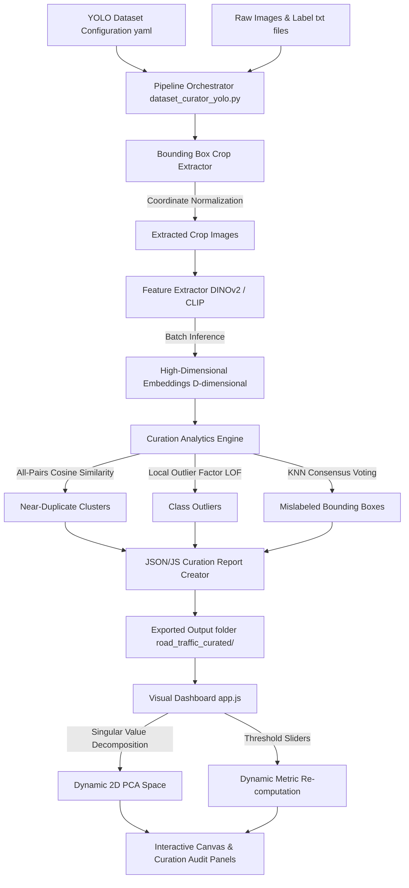

# CleanCrop: Technical Architecture & Curation Walkthrough

This document provides a deep-dive architectural explanation of the CleanCrop YOLO dataset curation pipeline, the underlying mathematical foundations of the anomaly detection algorithms, and the visual dashboard.

---

## 🗺️ System Architecture Flowchart

Below is the end-to-end data flow and processing pipeline:

---

## 🧠 Deep Mathematical & Algorithmic Explanations

### 1. Near-Duplicate Detection (Cosine Similarity)
To find duplicate images or near-identical bounding box crops, we measure the angular distance between their normalized embedding vectors.
For any two embedding vectors $\mathbf{u}$ and $\mathbf{v}$:

$$\text{Cosine Similarity}(\mathbf{u}, \mathbf{v}) = \frac{\mathbf{u} \cdot \mathbf{v}}{\|\mathbf{u}\| \|\mathbf{v}\|}$$

*   **Logic**: If the cosine similarity is greater than or equal to the `dup_threshold` (e.g. $0.95$), the two crops are grouped into a duplicate pair. 
*   **Optimization**: In the client-side dashboard (`app.js`), we construct an adjacency matrix using these similarities to dynamically cluster duplicates in real-time when the threshold slider changes.

---

### 2. Class Outlier Detection (Local Outlier Factor - LOF)
Outliers are detected per-class to accommodate domain shifts between different object categories (e.g., a "bicycles" crop shouldn't be compared directly to a "buses" crop). We use the **Local Outlier Factor (LOF)**:

*   **Local Density Estimation**: LOF computes the local reachability density (LRD) of a crop based on the distance to its $k$-nearest neighbors.
*   **Outlier Factor Calculation**: The LOF score is the average LRD of the neighbors divided by the crop's own LRD:

$$\text{LOF}_k(\mathbf{p}) = \frac{\sum_{\mathbf{o} \in N_k(\mathbf{p})} \frac{\text{lrd}_k(\mathbf{o})}{\text{lrd}_k(\mathbf{p})}}{|N_k(\mathbf{p})|}$$

*   **Interpretation**:
    *   $\text{LOF} \approx 1.0$: Density is similar to neighbors (in-distribution).
    *   $\text{LOF} \ge 1.3$: Density is significantly lower than neighbors (outlier/out-of-distribution).
*   **Dynamic Visual Tuner**: In the dashboard, we also calculate the **Centroid Distance** (similarity to the mean class vector) so users can filter out-of-distribution elements in real-time.

---

### 3. Mislabel Consensus Detection (KNN Voting)
To identify mislabeled bounding boxes, the pipeline performs a consensus vote among the $k$-nearest neighbors of each crop.

*   **Voting Procedure**: For a crop $\mathbf{p}$ with annotated class label $L$, we retrieve its $k$-nearest neighbors based on cosine similarity.
*   **Consensus Check**: If the proportion of neighbors sharing label $L$ is less than the `mislabel_consensus` threshold (e.g., $50\%$), the crop is flagged as a suspected mislabel. The suggested label is set to the majority class among the neighbors:

$$\text{Agreement Ratio} = \frac{|\{\mathbf{n} \in N_k(\mathbf{p}) \mid \text{label}(\mathbf{n}) = L\}|}{k}$$

---

### 4. Dynamic 2D Embedding Space Projection (SVD-based PCA)
To render high-dimensional vector embeddings (e.g., $768$-dimensional DINOv2 vectors) on a 2D scatter plot, we compute **Principal Component Analysis (PCA)** dynamically in the browser. 

We implement a fast **Power Iteration Method** to calculate the Singular Value Decomposition (SVD) of the centered covariance matrix.

#### Mathematical Steps:
1.  **Mean Centering**: Let $X$ be the $N \times D$ embedding matrix. Compute the mean vector $\mathbf{\mu}$ and subtract it to center the matrix:

$$\bar{X} = X - \mathbf{1}\mathbf{\mu}^T$$

2.  **Power Iteration for $PC_1$**: Initialize a random vector $\mathbf{w}_1$. Iteratively multiply by the covariance matrix and normalize until convergence:

$$\mathbf{w}_1 \leftarrow \bar{X}^T (\bar{X} \mathbf{w}_1)$$
$$\mathbf{w}_1 \leftarrow \frac{\mathbf{w}_1}{\|\mathbf{w}_1\|}$$

3.  **Deflation for $PC_2$**: Project $\bar{X}$ onto $\mathbf{w}_1$ to find the first principal component coordinates. Subtract this projection from a deep copy of the centered data to find the orthogonal residue:

$$\bar{X}_{\text{deflated}} = \bar{X} - (\bar{X} \mathbf{w}_1)\mathbf{w}_1^T$$

4.  **Power Iteration for $PC_2$**: Repeat the power iteration on $\bar{X}_{\text{deflated}}$ to solve for the second singular vector $\mathbf{w}_2$.
5.  **Projection**: Project the original centered embeddings onto the two principal components:

$$Y_1 = \bar{X} \mathbf{w}_1, \quad Y_2 = \bar{X} \mathbf{w}_2$$

The resulting coordinates $(Y_1, Y_2)$ form the beautiful 2D cloud plotted on the dashboard canvas.
